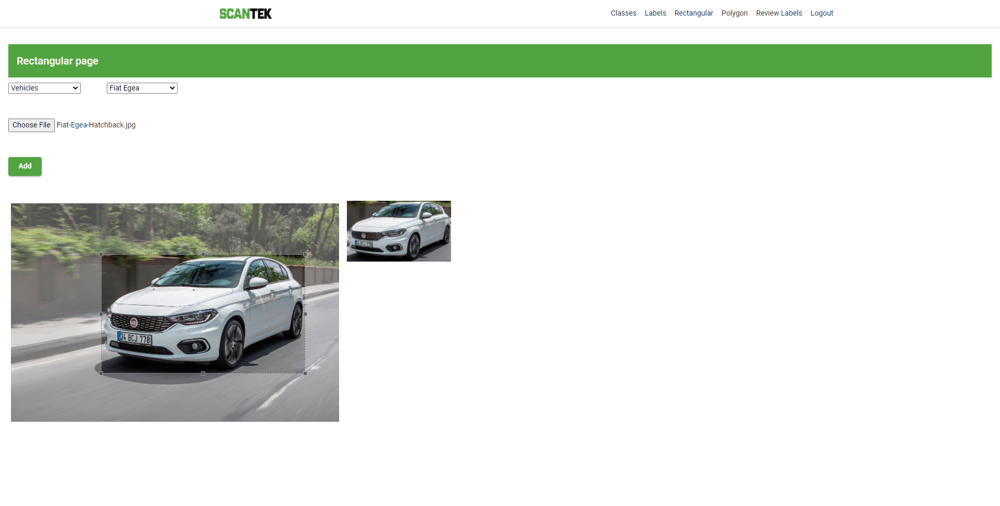

# Image Bank
a Project with Angular 12 and NodeJs 

I created this project a month ago to be used with an AI system for data mining based on recorded images with this system, it got published as a sample of my work.

Logo of [ScanTek](https://scantek.com/) is used in Frontend project.

Implemented Features:

- Used Postgres DB - included DB schema

- Backend:

  - NodeJS

  - JWT base user authentication

  - Authentication middleware

  - Keeping received images in a separated folder but thumbnails will be recorded in database

  - Pagination

  - Jpg and Png images are accepted

    

- FrontEnd:

  - Angular 12
  - CSS
  - Pagination
  - User authentication
  - Image input
  - Image layer selection with recording x,y and height and width of selected layer over image for later use (called labeling)
  - Dynamic NavMenu based on authentication
  - Review images and layers

Screen shots:

